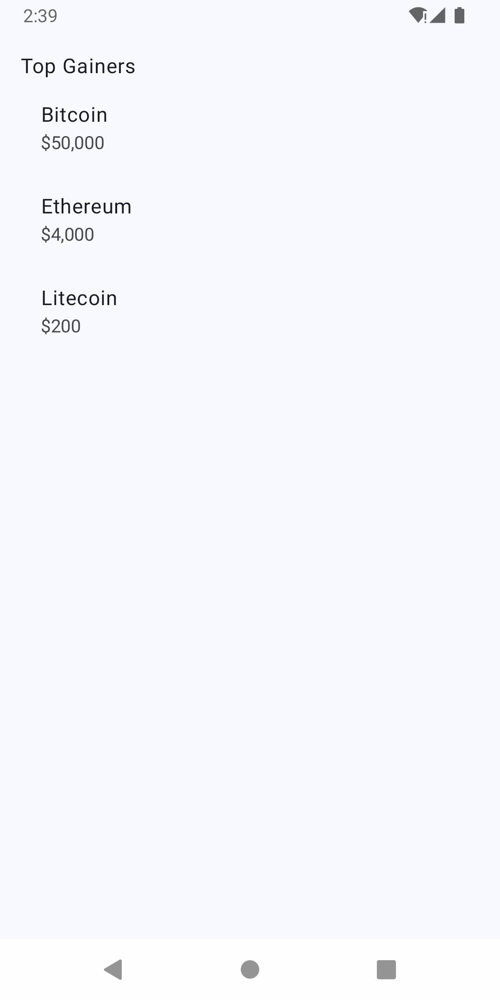

# 📱 KListDemo – Jetpack Compose List DSL

A custom fluent Kotlin DSL for building list screens using Jetpack Compose, inspired by the Modifier pattern.

## ✨ Features

- Chainable: `.padding()`, `.header()`, `.items()`
- Reusable item components
- Simple, clean API design

## 🖼️ Screenshot



## 🔧 Example

```kotlin
KList.instance
    .padding(16.dp)
    .header("Top Gainers")
    .items(coins) {
        KListItem(it)
    }
    .render()

